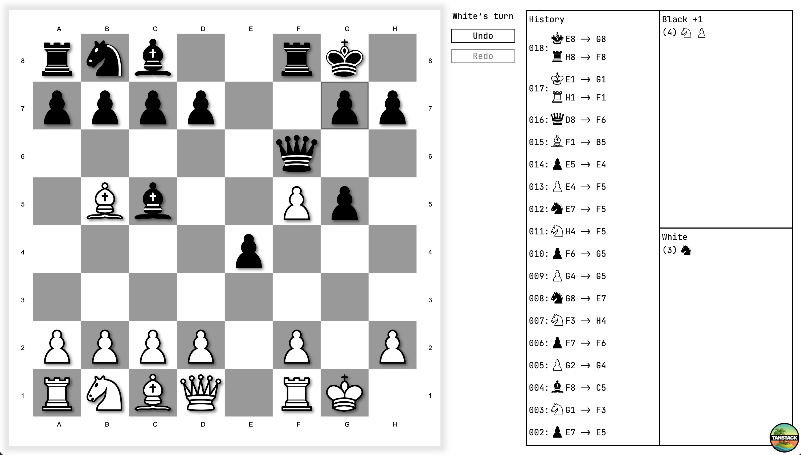

<div align="center">

# ♟️ chess-lib

**A chess engine you can actually read — plus the React bindings and a canvas board to prove it works.**

A framework-agnostic TypeScript chess engine, thin React hooks that bind it to any UI, and a polished Konva-rendered demo. All in one pnpm monorepo.

[](#-license)


<br />



</div>

---

## What's inside

`chess-lib` is split into three layers, so you take exactly what you need:

| Package | What it is | Depends on |
| --- | --- | --- |
| **[`@chess-lib/core`](packages/core)** | The chess engine — board, pieces, moves, history and full game rules. Pure, tree-shakeable ESM, **zero runtime dependencies**, no DOM. | — |
| **[`@chess-lib/react-hooks`](packages/react/hooks)** | A thin reactive layer binding the engine to React via `useSyncExternalStore`. The engine never learns it's inside React. | `core`, React ≥ 19 |
| **[`@chess-lib/demo`](apps/demo)** | A TanStack Start playground rendering the board on an HTML5 canvas (Konva) with animations, highlights and confetti. | `core`, `react-hooks` |

> The engine has no idea a screen exists. Run it in Node, a worker, a bot, or a browser — the rules are the same.

---

## ✨ Features

### Engine (`@chess-lib/core`)

- ♚ **Complete legal move generation** — pins, checks and self-check are all filtered out by simulating each candidate and reverting it.
- 🏰 **Every special rule** — castling (king- & queenside, with full path-safety checks), en passant, pawn double-step, and promotion to any piece.
- 🔁 **Fully reversible history** — every move knows how to `apply()` **and** `undo()` itself, powering unlimited undo/redo with a redo stack.
- 🏁 **Automatic outcome detection** — checkmate, stalemate and whose turn it is, computed after every move.
- ⚖️ **Material scoring** — captured-piece tracking and material balance per side.
- 🧩 **Data-driven pieces** — each piece is described by movement *deltas* + a move kind (`slide` vs `jump`); the base class does the walking. Adding a fairy piece is a few lines.
- 🆔 **Stable piece identities** — every physical piece carries an immutable `id`, perfect as a React render key across moves and promotions.
- 🔡 **Fully typed** — tile names (`"E4"`), colors, statuses and promotion targets are all exact string-literal types.

### React bindings (`@chess-lib/react-hooks`)

- 🪝 `useGame()` — subscribe a component to the game; it re-renders on every move, undo or redo.
- 🖱️ `useBoardSelection()` — click-to-select-and-move logic, legal-move + capture-target sets, and the promotion flow, done for you.
- ⚔️ `useTileAttackedFrom()` — check detection for highlighting a king in danger.
- 🗄️ `gameStore` — an external store (`tryMove` / `undo` / `redo`) with zero framework lock-in in the engine itself.

### Demo (`@chess-lib/demo`)

Canvas board (Konva) · click-to-move · animated piece slides · legal-move dots · red capture rings (incl. en passant) · king-in-check tremble · promotion picker dialog · move history · captured-material tray with `+N` advantage · undo/redo · and 🎉 **pawn-shaped confetti** on a win.

---

## 🚀 Quick start

Requires **Node 20+** and **pnpm**.

```bash
git clone https://github.com/Carlos-err406/chess-lib.git
cd chess-lib
pnpm install

# Play with the interactive board at http://localhost:3000
pnpm dev
```

> **Heads up:** the packages aren't published to npm *yet* — they're consumed inside the workspace via `workspace:*`. Publishing `@chess-lib/core` and `@chess-lib/react-hooks` is on the [roadmap](#-roadmap).

---

## 🎮 Using the engine

The engine is a plain object graph. No config, no globals — just `new Game()`.

```ts
import { Game, Colors } from '@chess-lib/core'

const game = new Game()

// Whose move is it?
game.turnColor // Colors.WHITE ('white')

// Read legal moves for a square, then play one
const from = game.board.tileAtName('E2')
game.getLegalMoves(from)          // [Tile E3, Tile E4]

const status = game.tryMove(from, game.board.tileAtName('E4'))
status // 'ongoing' | 'white wins' | 'black wins' | 'stale mate'

// Time travel
game.undo()
game.redo()

// Inspect the position
game.isCheck(Colors.WHITE)        // false
game.getMaterial()                // { white: {...}, black: {...} }
console.log(game.board.toString())
```

`board.toString()` gives you a dependency-free ASCII view (uppercase = white, lowercase = black):

```text
  ABCDEFGH
8 rnbqkbnr
7 pppppppp
6
5
4
3
2 PPPPPPPP
1 RNBQKBNR
```

Promotions are a third argument:

```ts
game.tryMove(from, to, 'Queen') // 'Queen' | 'Rook' | 'Bishop' | 'Knight'
```

## ⚛️ Using it in React

```tsx
import { useGame, useBoardSelection } from '@chess-lib/react-hooks'

function ChessBoard() {
  const game = useGame() // re-renders on every move/undo/redo
  const { selection, clickTile, promotionTarget, completePromotion } =
    useBoardSelection()

  return (
    <div className="board">
      {game.board.getTilesWithPieces().map((tile) => (
        <Piece
          key={tile.piece.id} // stable identity → smooth animations
          tile={tile}
          selected={selection?.from === tile}
          onClick={() => clickTile(tile)}
        />
      ))}
      {promotionTarget && <PromotionPicker onPick={completePromotion} />}
    </div>
  )
}
```

`useBoardSelection` handles the whole interaction state machine: first click selects a piece and exposes its legal moves; the second click moves it (or opens the promotion picker when appropriate).

---

## 🧠 How it works

A few design choices keep the engine small and easy to follow:

- **Pieces are described, not scripted.** A piece declares *how* it moves (`MoveDelta`s like `[1, 1]`) and *what kind* of mover it is — a `SLIDE`r walks a ray until it hits something, a `JUMP`er hops once. The shared base class in [`piece.ts`](packages/core/src/models/pieces/piece.ts) does the traversal; pawns override for their quirks.
- **Legality = "does this leave my king safe?"** `getLegalMoves` generates pseudo-legal candidates, then for each one it `simulateMove` → checks for self-check → **always reverts**. No board is ever left mutated by a query.
- **Moves are reversible commands.** Each move type (`GenericMove`, `CastlingMove`, `InPassantMove`, `PawnDoubleStepMove`, `PromotionMove`) implements `apply` / `undo`, so history, undo/redo and move simulation all share one mechanism.
- **React stays at arm's length.** `gameStore` wraps the pure `Game` in an external store and bumps a version counter on each mutation; `useSyncExternalStore` does the rest. Swap in Vue, Svelte or a CLI and the engine doesn't change a line.

---

## 🗂️ Project structure

```
chess-lib/
├── packages/
│   ├── core/                # @chess-lib/core — the engine
│   │   └── src/models/
│   │       ├── board/       # Board + Tile
│   │       ├── pieces/      # Piece base class + the 6 pieces
│   │       ├── history/     # Move command types + History
│   │       └── game.ts      # Game — rules, status, legality
│   └── react/hooks/         # @chess-lib/react-hooks — React bindings
└── apps/
    └── demo/                # @chess-lib/demo — TanStack Start + Konva
```

## 🛠️ Scripts

Run from the repo root:

| Command | Does |
| --- | --- |
| `pnpm dev` | Start the demo app on port 3000 |
| `pnpm build` | Build the demo for production |
| `pnpm build:packages` | Build the publishable packages (ESM + `.d.ts`) |
| `pnpm typecheck` | Type-check every workspace package |
| `pnpm test` | Run the test suites (Vitest) |
| `pnpm format` | Prettier + ESLint autofix |

**Stack:** TypeScript · pnpm workspaces · tsup (bundling) · Vitest · ESLint + Prettier. The demo adds TanStack Start, React 19, Tailwind CSS v4, shadcn/Radix, Konva, and `canvas-confetti`.

---

## 🗺️ Roadmap

- [ ] Publish `@chess-lib/core` and `@chess-lib/react-hooks` to npm
- [ ] FEN / PGN import & export
- [ ] Threefold-repetition and fifty-move-rule draws
- [ ] Drag-to-move on the demo board
- [ ] A small opponent/AI so you can play the demo solo

## 📄 License

[MIT](#-license) © [Carlos Daniel Vilaseca Illnait](https://github.com/Carlos-err406)
